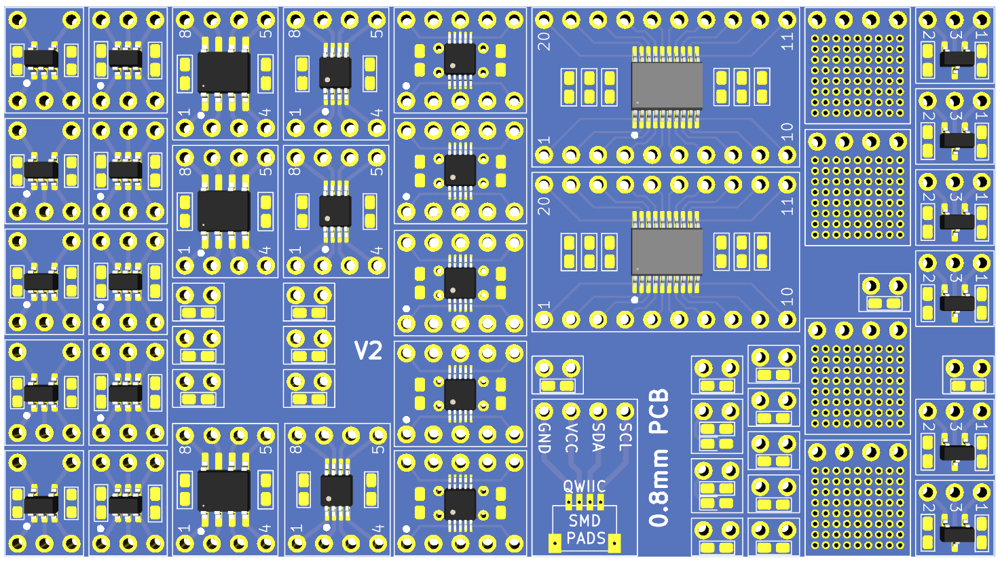

# SMD Adapters

This project contains small PCBs that allow to solder SMD components on through hole project boards. They are similar to boards that can be found on Aliexpress and other sources but have the following advantages:

* The IC and the pins are oriented in the same direction and same order, making it easier to find a pin or IC pad of a given number.
* There are no spare pins. For example, a SOT23-5 adapter has exactly 5 pins, eliminating the need to skip pin numbers.
* They can be ordered from PCB houses for for significantly lower cost. For example a 5 boards with 30 adapters each, can be ordered from JLCPCB for less that $4 shipped.
* The PCBs can easly cut with scisors, without having to pay for a V-score option. We order 0.8mm PCBs and cut them with regular scisors.
* You can easily customize the adapters as needed, for example, adding pads for bypass capacitors. 
* You can pick your color of choise. We ordered black PCBs.

